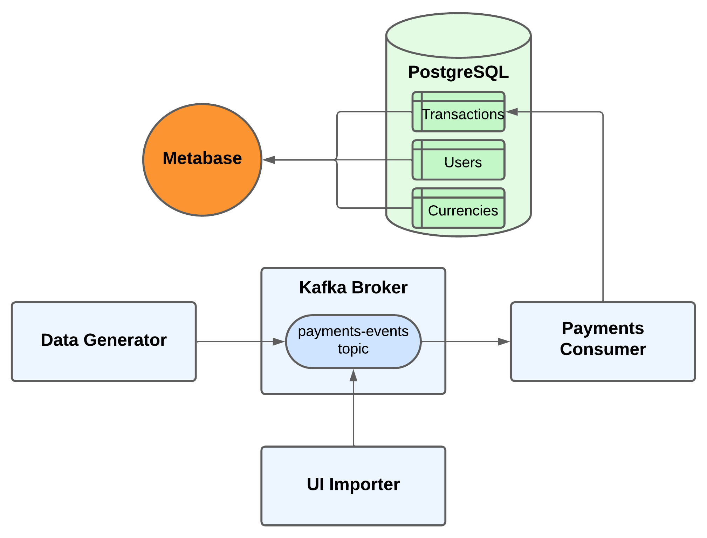

# Payments & Receivables Platform

## Introduction

This project is a simple, modular platform for managing payments and receivables. It demonstrates a modern event-driven architecture using Python microservices, Kafka for event streaming, and PostgreSQL for persistent storage. The platform allows you to ingest payment data (via CSV or synthetic generation), process and validate transactions, and visualize results through a dashboard interface.

---

## System Architecture



Below is a brief description of each container in the system:

### Containers Overview

- **Postgres**  
  The main relational database for storing users, currencies, and transaction records.

- **Broker**  
  Kafka broker is used as the event streaming platform for ingesting and distributing payment events.

- **Metabase**  
  An open-source business intelligence tool for visualizing and exploring the data stored in Postgres.

- **Payments Ingestion Service**  
  A Python service that consumes payment events from Kafka, validates them, and upserts them into the Postgres database. This service is also responsible for creating the Postgres tables, indexes, constraints, and triggers, as well as populating the users and currencies tables—all managed through migrations using the Alembic framework.

- **Data Generator**  
  A Python service that generates synthetic payment events and publishes them to Kafka for demonstration purposes.

- **CSV Importer UI**  
  A Flask web application that allows users to upload CSV files containing payment data. The app parses, validates, and streams the data to Kafka, highlighting duplicates and suspicious records (e.g., high-value transactions).

---

## Data Validation Flow

Validation in this platform is performed in two stages:

- **CSV Importer UI:**
  - Only checks if the uploaded file is a valid, non-corrupted CSV and remove duplicates. It does not validate the content or schema of individual records.

- **Payments Ingestion Service:**
  - Performs all record-level validation. Each record consumed from Kafka is checked against the expected schema.
  - Any record that fails schema validation is **not inserted** into the database, and a log entry is created for every invalid record, making it easy to audit and debug ingestion issues.

---

## How to Run

1. **Clone the repository:**
   ```bash
   git clone https://github.com/MarcosPampuch/payments-app.git
   ```

2. **Start the system using Docker Compose:**
   ```bash
   docker-compose up --build -d
   ```
   This will build and start all containers defined in the `docker-compose.yml` file.

3. **(Optional) View logs for a specific service:**
   ```bash
   docker-compose logs -f <service-name>
   ```

---

## Accessing the CSV Importer

Once all containers are running, you can access the CSV Importer UI to upload payment data:

- **URL:**  
  [http://localhost:5050](http://localhost:5050)

- **How to use:**  
  1. Open the URL in your browser.
  2. Upload a CSV file with payment records.
  3. The UI will display and drop any duplicate for you and also output suspicious records before sending them to Kafka for processing.

---

## Accessing Metabase Dashboards

Metabase provides a user-friendly interface to explore and visualize your payment data:

- **URL:**  
  [http://localhost:3000](http://localhost:3000)

- **Credentials:**
  - **User:** marcospampuch@gmail.com
  - **Password:** #1_Circle.

- **How to use:**  
  1. Open the URL in your browser.
  2. Log in with the credentials above.
  3. Navigate to the **Home** page.
  4. Access the **Overview Dashboard** to see the metrics and visualizations for your payment data.

---

## Pre-generated CSV Files for Import

A set of pre-generated CSV files is provided in the repository for testing and demonstration.

These files are located in the `csvs/` directory.

### CSV File Descriptions

- **transactions_data_full.csv**  
  A large dataset of transactions, intended primarily for initial database population and bulk testing.

- **suspicious_duplicated_transactions.csv**  
  Contains example transactions that include both duplicated records and records with amounts above the suspicious threshold (amount > 8000).

- **suspicious_transactions.csv**  
  Contains only transactions with amounts above the suspicious threshold (amount > 8000), but no duplicates.

- **duplicated_transactions.csv**  
  Contains only duplicated transaction records (no suspicious amounts).

- **regular_transactions.csv**  
  Contains only valid, unique transactions (no duplicates, no suspicious amounts).

---

## Environment

This project was developed and tested with the following versions:

- **Docker:** 28.1.1, build 4eba377
- **Docker Compose:** v2.35.1-desktop.1

---

## Future Improvements

Here are some ideas for future enhancements to this platform:

- **MinIO Integration:**
  - Add a dedicated MinIO container to store all files uploaded through the UI Importer for audit and backup purposes.

- **CSV Schema Validation:**
  - Implement stricter validation of CSV columns in the UI Importer to ensure only valid files are processed.

- **Topic Separation and Conditional Validation:**
  - Publish UI-imported records to a dedicated Kafka topic. The ingestion service would consume from both the synthetic and UI topics, applying different validation rules depending on the source.

- **Data Warehouse Replication:**
  - Develop a batch or streaming process (using Kafka Connect, Debezium, or custom code) to replicate data from Postgres to a data warehouse, enabling advanced analytics and dashboarding.

---

